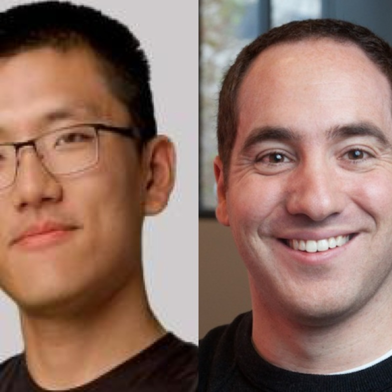

<!-- Add this CSS to control appearance -->

<!--  -->

The 1st iCNS/ECE Symposium on AI Research and Innovations (DuckAI 2025) is a one-day event organized by the Center for Innovative Computing and Networked Systems (iCNS) and the Department of Electrical and Computer Engineering at Stevens. It aims to bring together industry partners, researchers, faculty, and students to discuss recent developments of AI techniques and applications. The event features two technical sessions with invited talks and one poster & demo session. Around 30 student teams will showcase their AI projects for Spring’25. This event is open to the public with free registration.

## Event Details

* Thursday, May 15, 2025
* 8:30 a.m. – 3:00 p.m.
* **Burchard 111**, Stevens Institute of Technology
    * The poster session will be at **the B12 lab** underneath the library

<!-- 

## Agenda

* 8:30 AM - Check in
* 9:15 AM - Opening Remarks by ECE Department Chair: Dr. Min Song
* 9:30 AM - Invited Talk Session 1 - Host: Dr. Hao Wang
* 10:20 AM - Coffee Break
* 10:40 AM - Invited Talk Session 2 - Host: Dr. Shucheng Yu
* 11:30 AM - Lunch
* 1:00 PM - Student Project Poster & Demo
* 2:30 PM - Award announcement
* 3:00 PM - Adjourn -->

Registration link: [https://forms.gle/iPaCFxUheVo6YdGZ7](https://forms.gle/iPaCFxUheVo6YdGZ7)

## Invited Speakers

    <ul class="responsive-table" style="margin-left: 0; border-bottom: 0.1em solid whitesmoke;">
        <li class="table-row">
            

                

                    
                

            

            

                
<b><a href="">Josh Gordon, Yufeng Guo</a></b> | Google 

                <b>Google's AI tools for Developers</b>
                

                    
Join this session to learn how to get started with Google's latest AI tools and models, including Gemini, Gemma, JAX, and Keras. We'll cover the latest models, and how to get started.

                    
<b>Short Bio:</b> Josh leads AI Developer Relations at Google (fun fact, a groupJosh founded back in 2015). Josh also is an adjunct professor at Columbia, whereJosh occasionally teach classes on deep learning. Josh has extensive experience across many areas of AI---from classical methods, to deep learning, to the latest in generative AI---as well as applications across many fields. Josh wears many hats at Google, and have management and leadership experience.

                    
Yufeng Guo is a Developer Advocate at Google, specializing in Cloud AI. He is dedicated to making machine learning more understandable and usable for all. Yufeng is the creator of the YouTube series “AI Adventures,” which explores the art, science, and tools of machine learning.

                

                <button class="expand-btn" onclick="toggleContent(this)">More</button>
            
  
        </li>
        <li class="table-row">
            

                

                    
                

            

            

                
<b><a href="https://medium.com/@sanborse">Santosh Borse</a></b> | IBM 

                <b>Preparing data for LLM pre training and post training</b>
                

                    
Data Prep Kit ( https://github.com/data-prep-kit/data-prep-kit ) is built to support both structured and unstructured data across diverse domains, It enables development team to focus on model development by reducing the time and effort required for data preprocessing. Santosh will take your though the challenges in pre training data and how DPK is used to solve those challenges. Data Prep Kit is a open source project, Santosh will also go through the open source contribution opportunities for participants.

                    
<b>Short Bio: </b>Santosh Borse is an experienced software engineer with 20 years of expertise in designing, developing, and managing complex software systems. He currently works as a <b>Senior Research Engineer @ IBM Research</b>, where he focuses on preparing and processing data for training the IBM Granite series models. Throughout his career, Santosh has held roles ranging from Junior Developer to Architect, contributing to impactful projects across AI, NLP, IoT, cloud computing, and more. He is also a named inventor on several granted patents in emerging technologies. Driven by a passion for problem-solving and innovation, Santosh believes in <b>making the world a better place through software</b>—a principle that continues to guide his work every day.

                

                <button class="expand-btn" onclick="toggleContent(this)">More</button>
            
  
        </li>
        <li class="table-row">
            

                

                    
                

            

            

                
<b><a href="http://www.shiranthawelikala.com">Dr. Shirantha Welikala</a></b> | ECE @ Stevens Institute of Technology 

                <b>Online Distributed Graph Neural Networks for Distributed Optimal Control of Networked Cyber-Physical Systems</b>
                

                    
In modern large-scale networked cyber-physical systems such as smart grids, robotic networks, and supply chain networks, ensuring optimal performance while maintaining scalability and resilience is a critical challenge. Although powerful, classical optimal control techniques are often centralized and assume full system knowledge, making them ill-suited for decentralized implementation and online adaptation in dynamic environments. This talk presents a novel Graph Recurrent Neural Network (GRNN)-based framework for distributed optimal control in networked cyber-physical systems (N-CPS). Unlike prior approaches that either lack true decentralization or rely on offline training, our method enables online, fully distributed learning of optimal control laws using only local information and local communication among subsystems. We cast the problem as a self-supervised learning task and develop a consensus-inspired distributed training algorithm that allows each agent to independently adapt its controller weights over time. We establish local closed-loop stability guarantees to ensure safety and predictability by leveraging sector and slope restrictions on the nonlinear activation functions used in the GRNN. Numerical results have demonstrated the scalability and real-time training capabilities of the proposed method. The talk will also present ongoing efforts to generalize this framework to nonlinear settings and integrate it into a broader control-topology co-design paradigm for N-CPS.

                    
<b>Short Bio: </b>Shirantha Welikala is currently an Assistant Professor in the Department of Electrical and Computer Engineering, Stevens Institute of Technology, Hoboken, NJ, USA (joined Fall 2023). He received the B.Sc. degree in Electrical and Electronic Engineering from the University of Peradeniya, Peradeniya, Sri Lanka, in 2015 and the M.Sc. and the Ph.D. degrees in Systems Engineering from Boston University, Brookline, MA, USA, in 2019 and 2021, respectively. From 2015 to 2017, he was a Temporary Instructor/Research Assistant in the Department of Electrical and Electronic Engineering at the University of Peradeniya, Sri Lanka. From 2021 to 2023, he was a Postdoctoral Research Fellow in the Department of Electrical Engineering, University of Notre Dame, Notre Dame, IN, USA. His main research interests include control and optimization of cooperative multi-agent systems, control of networked systems, passivity-based control, control and topology co-design, machine-learning, robotics, and smart grid. He has received several awards, including the 2015 Ceylon Electricity Board Gold Medal, the 2019 and 2023 President's Awards for Scientific Research in Sri Lanka, the 2021 Outstanding Ph.D. Dissertation Award in Systems Engineering at Boston University, and the 2022 Best Paper Award at the 30th Mediterranean Conference on Control and Automation held in Athens, Greece. For more information, please visit <a href="http://www.shiranthawelikala.com">http://www.shiranthawelikala.com</a>.

                

                <button class="expand-btn" onclick="toggleContent(this)">More</button>
            
  
        </li>
        <li class="table-row">
            

                

                    
                

            

            

                
<b><a href="">Zengye Wang</a></b> | Armistice Capital LLC 

                <b>Data Engineering in Hedge Funds: Managing Data at Scale for Finance</b>
                

                    
This talk highlights the role of data engineering in the fast-paced environment of hedge funds. It covers how engineers design and maintain scalable data pipelines, ensure data quality and integrity, and support a wide range of teams from research to compliance. Learn how modern data infrastructure enables better decision-making in the financial industry.

                    
<b>Short Bio:</b> Zengye is a full stack quantitative engineer---frontend, backend, site reliability, distributed computing, model implementation. He previously worked at multiple hedge funds and is experienced with production systems.
 
                

                <button class="expand-btn" onclick="toggleContent(this)">More</button>
            
  
        </li>
        
    </ul>

## Organizers:

* [Shucheng Yu](https://www.stevens.edu/profile/syu19) (ECE@Stevens Institute of Technology)
* [Hao Wang](https://intellisys.haow.us/haowang/) (ECE@Stevens Institute of Technology)
 
<!-- 
**Important Dates:**
* ~~Submission deadline: April 1, 2025~~
* ~~Acceptance notification: April 15, 2025~~
* Final version: May 30, 2025
* PER Camera ready: June 30, 2025
* Workshop date: June 13, 2025 -->
